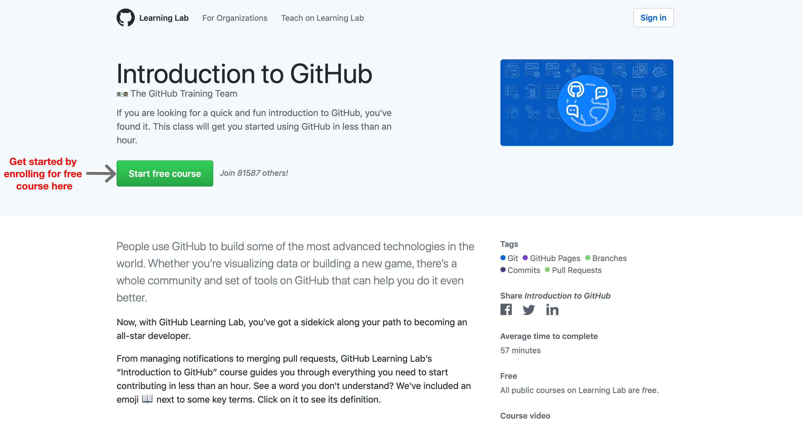
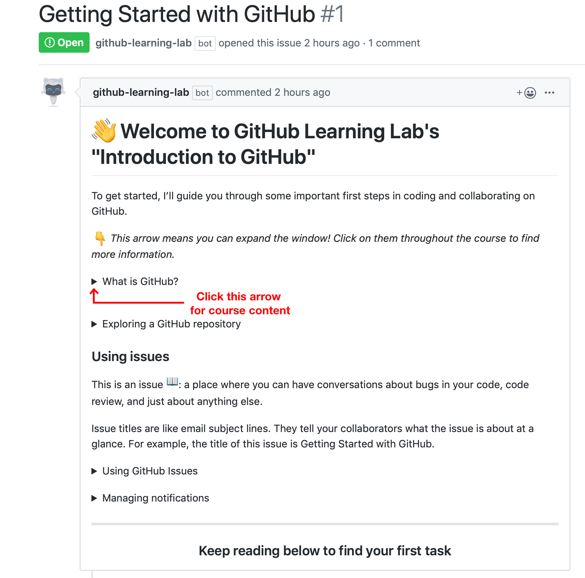

# Remote-Mentorship-Program
TechnoJam presents a **remote-mentorship-program** for those passionate about learning how to code.
This is the task repository for students to get selected in TechonJam's Remote mentor-ship Program.
So get ready and complete the below tasks to get selected. 

 
 

## Step 1

* Start by getting your basics clear about github by completing  [this](https://lab.github.com/githubtraining/introduction-to-github) course on github learning lab. 

 
 

#### Note: _Don't forget to click on each arrow and follow step by step guide to get this course completed._

 

 
 

## Finally
* Fill out [this](https://docs.google.com/forms/d/1DmYiqZ7pC-KjgXPmQcW_dMWosRM7U8bBFjbOxc_9WFg/) google form. 
Dont forget to add your github link where you completed this course.
It should look something like 
https://github.com/your_github_username/github-slideshow